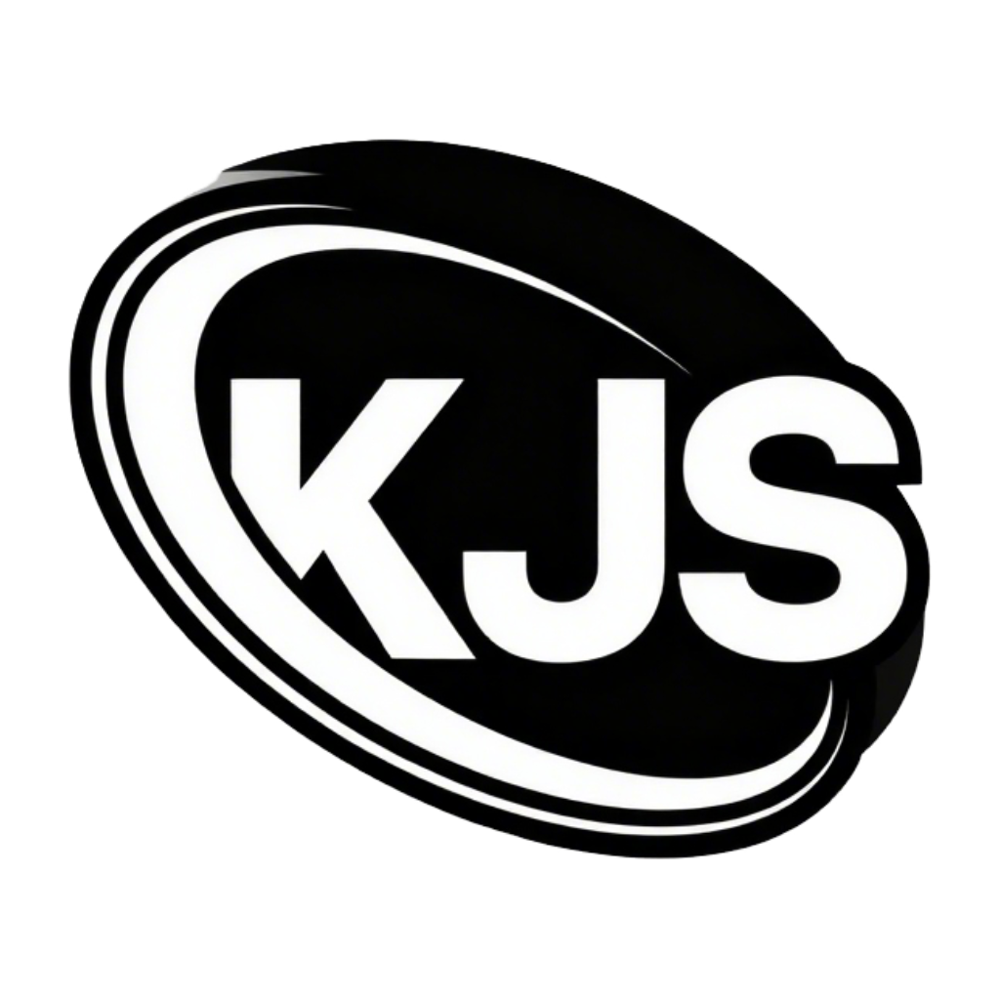

<a href="http://kjsone.dsheep.com">

<h1 style="border-bottom: none;" align="center">KJSone's Blog</h1>
</a>

 

Hugo搭建的博客，使用了 [Stack](https://github.com/CaiJimmy/hugo-theme-stack) 主题。会分享一些自己在开发过程中遇到的问题，以及如何解决的。还会分享一些小故事。

## 个人简介

名称：[KJSone](https://kjsone.dsheep.com)

职业：前端开发者

组织：[大羊实验室](https://dsheep.com)

学校：[河北科技学院](https://www.hbkjxy.edu.cn/)

开发喜好：喜欢使用 Tailwindcss，不喜欢组件库

技术栈：MySQL、Node.js、Vue3、React、Vue-Router、Pinia、ApiFox、CNB CI/CD、Docker、HTML、CSS、Javascript、Typescript、Axios、Express、Vite、Linux 其他技能正在开发中...

实习经历：驰大数据科技（上海）股份有限公司(2025.07-2026.07)

项目经历：[固件羊](https://easyhey.com)、固件广场

目前在做什么？ 正在学习小程序开发；参加组织的项目开发。

